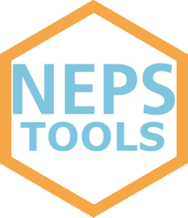

<!-- README.md is generated from README.Rmd. Please edit that file -->

# nepstools <a href="https://a-helbig.github.io/nepstools/"></a>

<!-- badges: start -->

<!-- badges: end -->

This package facilitates working with R and NEPS SUF data. Its main
feature — and the core of the package — is a function that efficiently
reads NEPS SUF files in Statas dta format. It allows you to specify
German or English language, a switch to instrument variable names and
access to all attached meta information on variables. It builds upon
haven’s read_dta() and readstata13’s read.dta13() functions, leveraging
the strengths of both. The package is inspired by the stata ado
[nepstools](https://www.neps-data.de/Datenzentrum/Forschungsdaten/Datentools-f%C3%BCr-Stata)
developed by the FDZ of the Lifbi in Bamberg, Germany.

## Citation

If this package contributes to your research, please consider citing it.
I would greatly appreciate it.

Suggested citation:

Alexander Helbig (2026). *nepstools*. Version 0-1-4 \[Computer
software\]. <https://github.com/a-helbig/nepstools>

## Installation

You can install *nepstools* with the remotes package as follows:

``` r
# install.packages("remotes") - uncomment this row in case you havent installed package "remotes" yet
remotes::install_github("a-helbig/nepstools")
```

## Example

We need to load a NEPS dataset that includes variable and value labels
in English, and also want to access the question texts associated with
the variables.

Using haven::read_dta() did not provide access to the English labels or
the question texts. We also tried readstata13::read.dta13(), but
although it loads metadata (including English labels), these were only
attached at the dataset level, not directly to the variables.
Additionally, this function tends to be relatively slow when working
with larger datasets.

To achieve our goal, we can use the read_neps() function as demonstrated
below:

``` r
library(nepstools)

# File path to publicly available NEPS SC6 semantic structural file on gaps in lifecourse that is included in this package
path <- system.file("extdata", "SC6_spGap_S_15-0-0.dta", package = "nepstools")

# read data with english labels and meta
df_neps <- read_neps(path, english = TRUE)

# Example Variable: ts2912m - enddate (month) of gap episode
# Print english variable label 
attr(df_neps$ts2912m, "label")
#> [1] "End month gap"
# Print english questiontext with convenient wrapper nepstools::question()
question(df_neps, "ts29103")
#> [1] "Just to make sure: Are you still retired today?"
# Search for the variable, that holds the type of gap with nepstools::lookfor_meta. Search only in the label attributes.
lookfor_meta(df_neps, "type", "label")
#> $`Variable ts29101_v1: @label`
#> [1] "Type of gap"
#> 
#> $`Variable ts29101: @label`
#> [1] "Type of gap"
#> 
#> $`Variable spms: @label`
#> [1] "Check module: spell type"
```

The package provides a handful of smaller functions that facilitate
working with NEPS data:

1.  `replace_values_with_na()`: replacing NEPS missing values with NA
2.  `replace_season_codes()`: recoding season codes to corresponding
    months
3.  `expand()`: expanding episode data by duration
4.  `question()`: wrapper of attr function for printing question texts
5.  `lookfor_meta()`: searching for keywords in attributes of dataframe
    columns (meta info)

For more details, please checkout the *nepstools* vignette.
